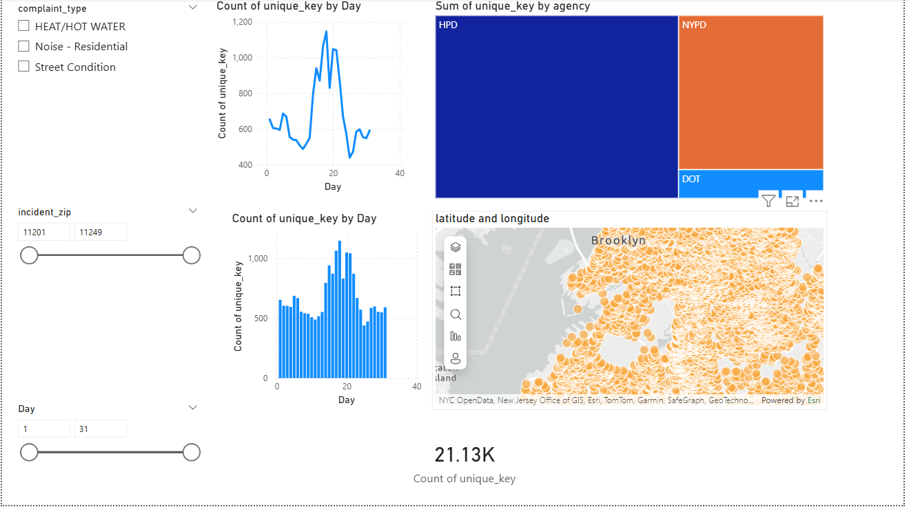
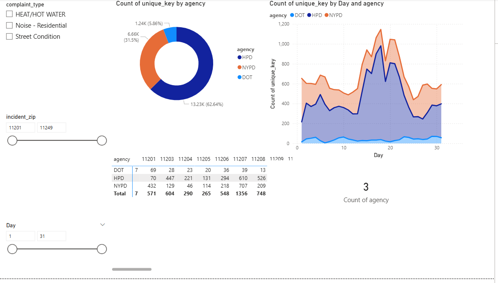
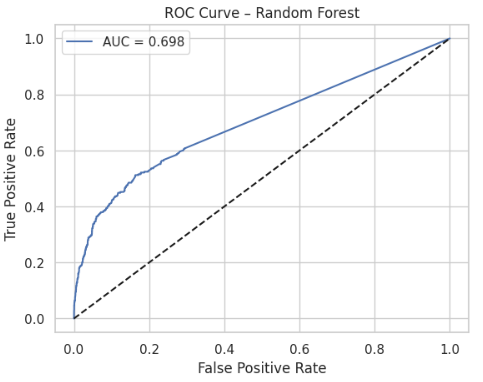
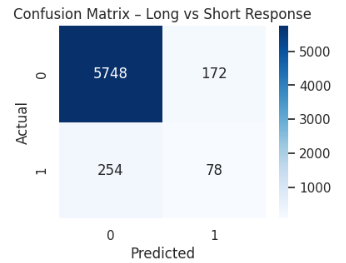

# nyc-311-service-request-analytics
## Project Overview 
This project analyzes New York City's 311 Service Request data to identify operational patterns affecting service resolution times and to develop predictive models for identifying delayed responses. Using big data analytics tools, machine learning models, and interactive dashboards, the project explores how complaint type, agency, borough, and request characteristics influence response efficiency across NYC public services.  
## Business Problem
New York City's 311 system receives millions of non-emergency service requests related to housing, sanitation, transportation, infrastructure, and public safety. Long service resolution times can reduce public trust and create operational inefficiencies for city agencies. 
This project answers two key questions: 1. What factors influence NYC 311 request resolution times? 
2. Can machine learning models predict whether a request will experience a delayed response? 
## Dataset Source: 
NYC Open Data – 311 Service Requests 
Dataset Size: 
- Original dataset: ~24GB
- Millions of records 
- Sampled datasets used for analysis: - 20,000
- records for dashboarding: 50,000 records for predictive modeling 
## Tools and Technologies 
- Python
- Pandas
- NumPy
- Scikit-learn
- Matplotlib
- Seaborn
- Power BI
- Google Colab 
## Project Workflow 
1. Big data preprocessing and chunk-based sampling
2. Data cleaning and feature engineering
3. Exploratory Data Analysis (EDA)
4. Interactive dashboard development
5. Regression modeling
6. Random Forest classification modeling
7. Model evaluation and interpretation 
## Dashboard Insights 
### Key Findings 
Housing, policing, and transportation agencies handled the highest request volumes. 
Service requests showed strong geographic clustering across boroughs.  
Request volume varied significantly across days and seasons. 
Location and request type strongly influenced resolution delays. 
## Machine Learning Models
### Linear Regression Goal: 
Predict the number of days required to close a request. 
Results: 
- MAE: ~0.35 days
- RMSE: ~0.54 days
- R²: ~0.11 
### Random Forest Classification 
Goal: Predict whether a request will take longer than one day to resolve.
 Results:
- Accuracy: ~93%
- ROC-AUC: ~0.70  
## Visualizations
### Dashboard 1  
### Dashboard 2  
### ROC Curve  
### Confusion Matrix  
## Business Impact 
This project demonstrates how predictive analytics and dashboard-driven insights can support: 
- Faster resource allocation 
- Improved operational planning 
- Better service delivery 
- Increased public trust 
## Future Improvements 
- Analyze the complete NYC 311 dataset using Apache Spark 
- Incorporate weather and staffing data 
- Improve class imbalance handling 
- Deploy predictive models through a web dashboard 
## Author Vaibhavi Sukale
